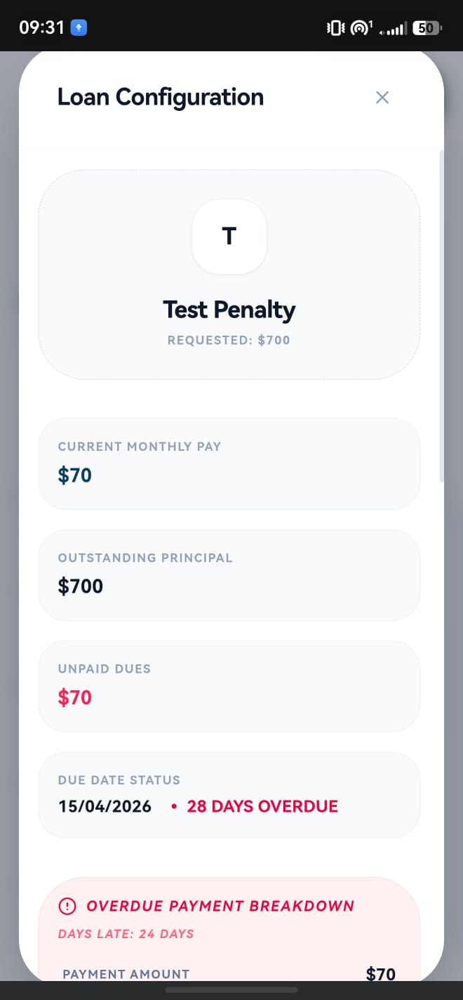
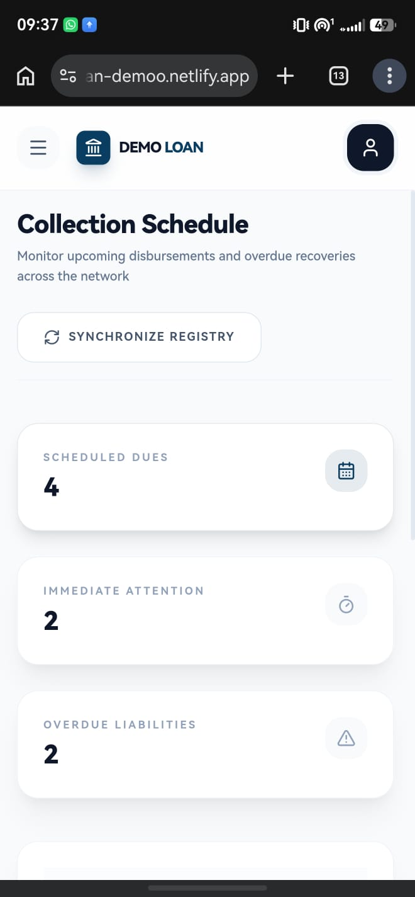
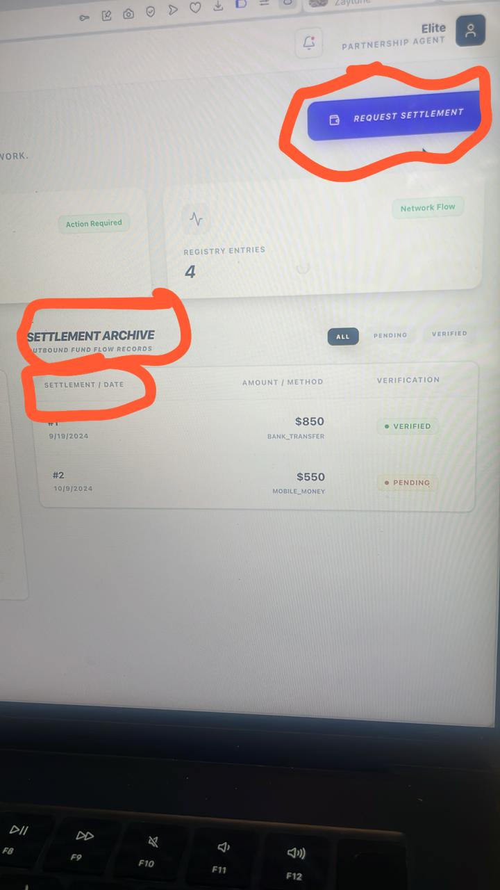
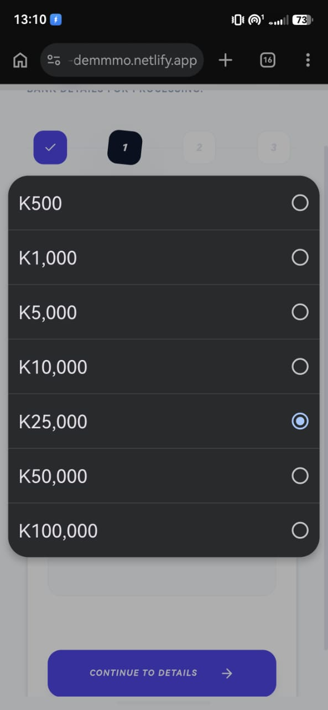
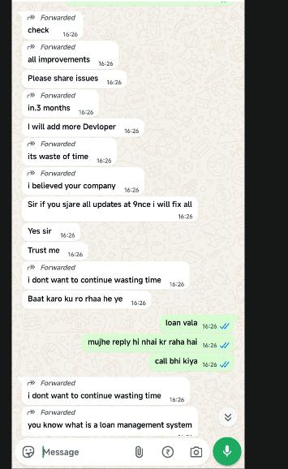
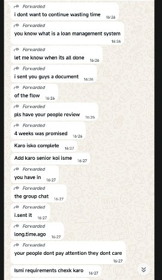
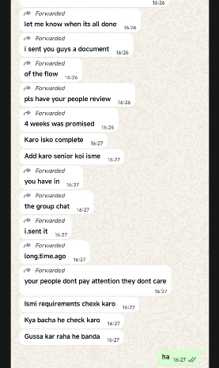

Modifications:
- Requirements to apply for loan
- ⁠Include dates in dashboard for when the loan was taken out, upcoming payment
- ⁠On the administrator’s dashboard there should be an option to see the pending loans so he/she can approve or deny them

i want to be able to download the excel file

and for crm automatic upcoming payment reminders

Hi, 
1. I don't understand why when looking at a client's hub, under the Loan Status tab if I click on Total Debt it takes me to the Repayment Hub tab but the information shown there does not show me the total debt in better detail. 
2. In the client's hub, under the My Contracts tab the Active Balance total amount is not the same as if I add up the Loan Amounts and subtract the Principals Paid.
3. In the client's hub, under the Repayment Hub there is no button to pay.
4. In the Agent's Hub in the Commissions tab there is a button on the right side that says Request Settlement. The button pops up a page where you can request a settlement but I would like to know what it is intended for. What would be settled?

Sure, will review and let you know of the changes needed here 
you havent changed the K to MXN also allow client to type custom amount

i submited it doesnt show on the pipeline applications
Hello, I'm going over the platform and we need the following:
When reviewing a submission form from the administrator's account, there should be an option to type in a number for the interest rate the administrator decides that specific application should get. Once the application is approved and the interest rate is set, the client should be able to review the final terms of the loan (optimally in the form of a contract with the client's information and the information taken from the loan request he submitted and the interest rate the administrator set). The terms of this loan offer would have a deadline. The client would then get to decide if he agrees to these terms and digitally signs the contract, or if he doesn't and the loan would not go through.
Ok, I am currently going over the rest of the platform

1. I see where the information for the interest rate would be set. That is fine. But what needs to be changed then is in the Dashboard under the Pending Approval Queue, on the right side of each pending loan request, there is a button that says "Review". That button should take me to the same page where I would be if I went to the Incoming Applications page and clicked on the same pending loan request.
2. The contract I mentioned after the loan was approved should be included and the client would then have to accept the terms in order to receive the funds.
3. The reports from the Export Report button on the Dashboard should be a .xslx (Excel) file so we can work with the data.

These three changes are the only changes that I noticed
Notes: 
1. The Protocol Status in the Incoming Applications tab for the administrator’s account should be a little more accurate. Not just pending, it should say pending whenever the application is awaiting the review from the administrator but once the offer is sent back to the client, it should say “Pending Client Approval”.

Other than that, the rest looks good
Ooh and the reports should include all the information of the loans (client name, capital, interest rates, etc), including date of signature once the loan terms are accepted
Hi, the only issue I've found on the platform so far is on the review for approval for a loan under the administrator account, the Initial Fee I think shouldn't be a percentage of the capital, but rather an amount in $

The three texts in the boxes say settlement instead of Payout

borrower only request id and proof of addresss

